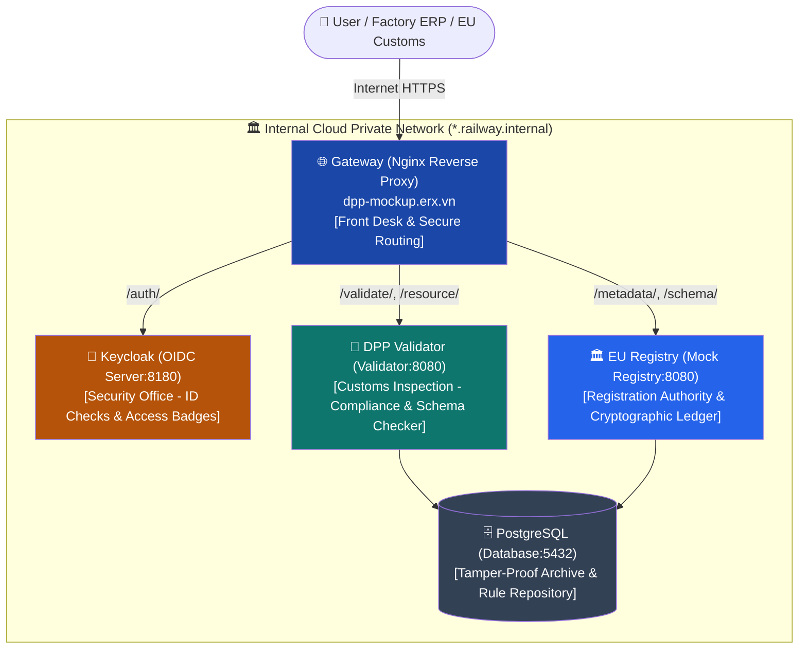
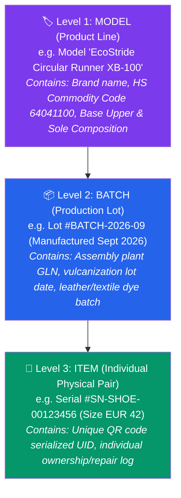
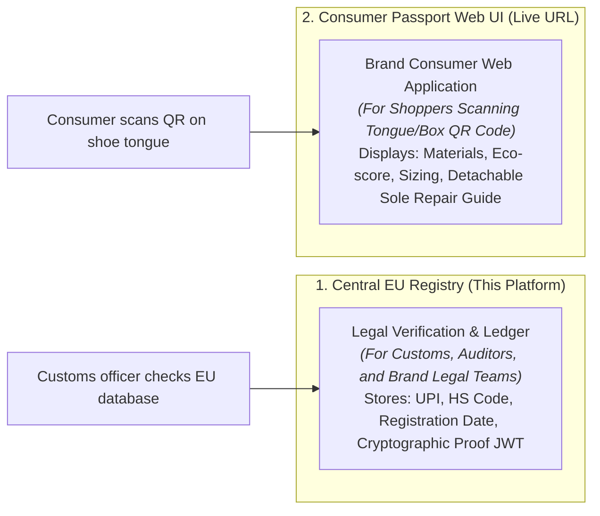
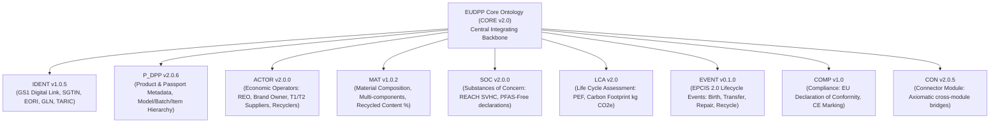
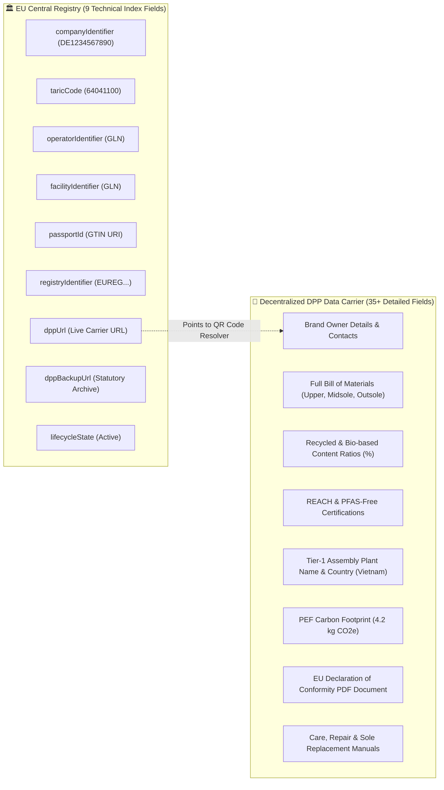
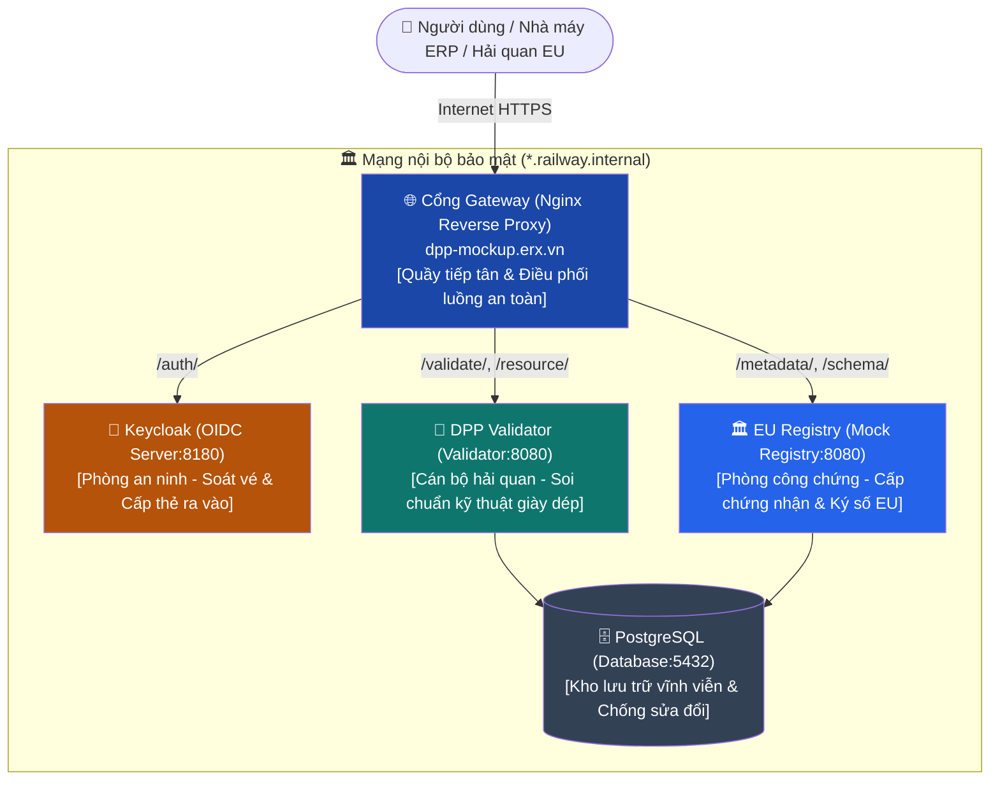
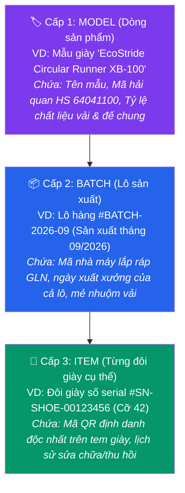
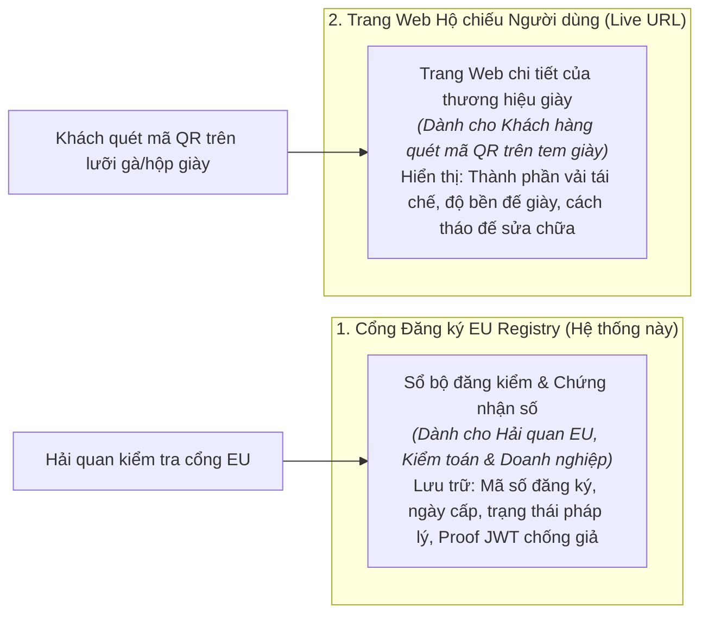
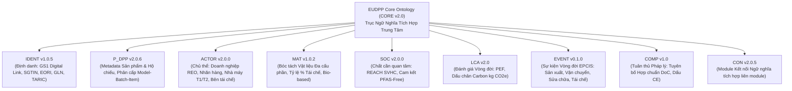
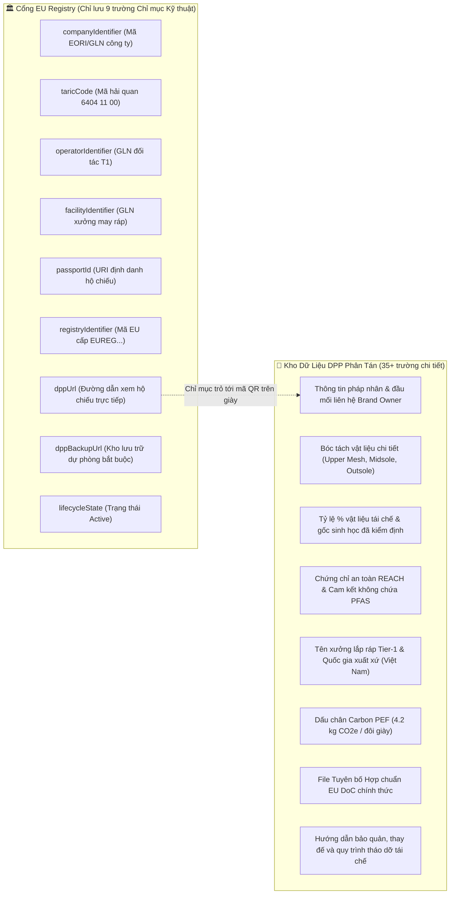

# 🇪🇺 Digital Product Passport (DPP) — Complete Blueprint & Operational Guide

> **This document explains what the Digital Product Passport (DPP) is, how the system operates, data ingestion, product verification, licensing, and cloud operations using the Footwear industry as an end-to-end practical example — written in accessible, everyday language for non-technical and non-data audiences.**
>
> *(Tài liệu này giải thích Digital Product Passport (Hộ chiếu Sản phẩm Kỹ thuật số) là gì, hệ thống hoạt động ra sao, cách nhập liệu, xem sản phẩm, bản quyền và vận hành thực tế bằng ví dụ ngành Giày dép (Footwear) — được trình bày song ngữ Anh - Việt dễ hiểu nhất dành cho người không chuyên về công nghệ & dữ liệu).*

---

## 🌐 Language Navigation / Điều hướng Ngôn ngữ
* 🇬🇧 [English Version (EN)](#-part-1-what-is-dpp-and-why-is-it-mandatory)
* 🇻🇳 [Phiên bản Tiếng Việt (VI)](#-phần-1-dpp-là-gì-và-tại-sao-lại-bắt-buộc-đối-với-ngành-giày-dép)

---

# 🇬🇧 ENGLISH VERSION

## 📖 Part 1: What is DPP and Why is it Mandatory?

### 1. Everyday Intuitive Example: The Story of a Pair of Sneakers
Imagine you are buying a new pair of athletic running shoes:
* You want to know: *Where were these shoes manufactured? Who made them?*
* You want to verify: *Are the uppers genuinely made from 100% recycled ocean-bound plastics? Is the sole made of natural rubber or toxic chemicals (PFAS-free)? How many kilograms of carbon (CO₂) were emitted during manufacturing?*
* Customs & Regulators want to verify: *Do the shoes comply with EU safety regulations? Can the sole be detached and recycled at end-of-life?*

Today, this information is **heavily fragmented** — a tiny blurry label stitched inside the shoe tongue, a cardboard hangtag thrown into the trash, and technical data locked inside private manufacturer databases. Neither customs officers nor consumers can verify authenticity.

👉 **DPP solves this problem.** Every pair of shoes sold in the EU will carry a unique "Digital Product Passport" — functioning exactly like an official **National Identity Card / Passport for physical goods**.

### 2. Official Definition
> **Digital Product Passport (DPP)**: An electronically accessible dataset that collects and shares product-related information across its entire lifecycle: **from raw material harvesting ➔ textile weaving & sole molding ➔ factory assembly ➔ international transport ➔ consumer usage ➔ repair ➔ circular recycling / second life**.

### 3. Who is Mandated by Law?
The **European Union (EU)** — enacted through the **ESPR (Ecodesign for Sustainable Products Regulation)**:
* **Starting 2026 – 2027**: Mandatory first for **Footwear & Textiles (Giày dép & May mặc)** and **EV & Industrial Batteries**.
* **Subsequent years**: Expanding to Consumer Electronics, Iron & Steel, Chemicals, and Construction Materials.
* **Impact**: Any enterprise worldwide (including footwear manufacturers in Vietnam, Asia, or America exporting to the EU) **must have an official DPP** before goods can clear European customs.

---

## 🏗️ Part 2: System Architecture (5 Interconnected Components)

The complete DPP platform operates like a **Digital Administrative Agency**, consisting of 5 seamlessly coordinated microservices:



### Real-World Analogy:

| Technical Component | System Name | Real-World Role |
| :--- | :--- | :--- |
| **Nginx Dashboard** | API Gateway & Web UI | **Front Desk Receptionist**: The single public entry point facing the outside world; safely guides visitors to the right internal office. |
| **Keycloak** | OIDC Identity Provider | **Security Guard**: Verifies corporate credentials and issues temporary access badges (JWT tokens) to authorized operators. |
| **DPP Validator** | Schema & Compliance Engine | **Customs Inspector**: Scrutinizes every line of product data against mandatory EU environmental and circularity standards. |
| **Mock EU Registry** | Central Registration Portal | **Government Notary**: Stamps official registration records and issues a tamper-proof cryptographic Certificate (Proof JWT). |
| **PostgreSQL** | Relational Database | **Secure Permanent Vault**: Safely preserves all registration records, lifecycle audits, and regulatory standard schemas. |

---

## 👥 Part 3: Roles & Permissions

The platform enforces 3 strictly segregated roles to prevent unauthorized modifications:

| Role | Technical Username | Sample Password | Real-World Responsibility |
| :--- | :--- | :--- | :--- |
| 🔑 **Administrator (Admin)** | `admin-user` | `admin123` | System operator; uploads new EU regulatory standards (JSON Schemas) and manages server health. |
| 🏭 **Economic Operator (EO)** | `eo-user` | `eo123` | Shoe manufacturer (e.g. *EcoStride Footwear AG*); registers new shoe models, submits batch declarations, and updates passports. |
| 👤 **End User / Authority (EU)** | `eu-user` | `eu123` | Customs officers, market surveillance inspectors, or retail consumers; reads passport data, verifies cryptographic proofs. |

---

## 📊 Part 4: 3-Tier Granularity Hierarchy in Footwear

In the footwear industry, DPP data is organized in a **3-tier hierarchical pyramid**:



* **Level 1 (MODEL)**: General design blueprint. Allows customs to confirm whether the shoe style meets European safety standards and chemical bans (PFAS-free).
* **Level 2 (BATCH)**: Production run. If a specific lot of adhesive or rubber fails quality tests, the brand recalls only that specific batch rather than all shoes ever made.
* **Level 3 (ITEM)**: The exact physical pair you wear. Contains a unique serial number tied to the physical QR code on the shoe tongue, enabling individual repair tracking and take-back recycling.

---

## 📐 Part 5: DPP Validator & JSON Schemas

The Validator is the automated quality gatekeeper:

### 1. What is a JSON Schema?
Think of a JSON Schema as an **official regulatory checklist**. For Footwear under EU rules, a valid passport must declare:
1. Manufacturer legal entity & physical address (`name`, `streetName`, `postalCode`, `cityName`, `country`)
2. Unique Product Identifier (`productUID`)
3. Carbon Footprint declaration (`carbonFootprint.lifeCycleCarbon`, `carbonFootprintPerformanceClass`)
4. Circularity parameters (`repairabilityScore`, `detachableSole`, `recyclingInstructions`)

### 2. Green vs. Red Validation
* **Red (`❌ INVALID`)**: If the manufacturer omits required fields (e.g., missing street address or repairability score), the Validator pinpoints the exact offending lines and blocks registration.
* **Green (`✅ VALID`)**: When all required fields are present and correctly formatted, the payload is cleared for submission to the EU Registry.

> [!NOTE]
> **Unique Schema Constraint**: Each regulatory schema version (e.g. `footwear-schema` version `1.0.0`) is stored once in the PostgreSQL database. If re-uploaded, the system detects its presence and advises proceeding directly to validation.

---

## 💻 Part 6: How to Input Data into the System

Data can be ingested via **two primary pathways**:

### Method 1: Web Testing Dashboard (Ideal for Pilot Testing & Auditing)
URL: **[https://dpp-mockup.erx.vn](https://dpp-mockup.erx.vn)**

1. **Step 2 (Auth)**: Click **`⚡ Quick Login EO`** or **`⚡ Quick Login Admin`** to acquire a 24-hour access token.
2. **Step 4 (Validation)**:
   * Select **`👟 Valid Footwear Sample`**.
   * Click **`Validate Payload`** to verify compliance against the Footwear Schema.
3. **Steps 5, 6, 7 (Registration)**:
   * Enter the Unique Product Identifier (`UPI`), Registered Economic Operator (`REO ID`), Commodity Code (`64041100`), and `Live URL`.
   * Click **`Register MODEL / BATCH / ITEM`** to write data to PostgreSQL and obtain a permanent `Registry ID`.

### Method 2: Automated REST API (For Factory ERP & PLM Integration)
In high-volume manufacturing (thousands of pairs per day), factory assembly lines automatically push data via REST API:
* **Gateway API Endpoint**: `https://dpp-mockup.erx.vn`
* **OpenAPI Specification**: `https://dpp-mockup.erx.vn/q/openapi`
* **Automated Workflow**:
  1. Factory ERP authenticates: `POST /auth/realms/dpp-registry/protocol/openid-connect/token`
  2. ERP pushes batch registration: `POST /metadata/v1/registerDPP` with Header `Authorization: Bearer <TOKEN>`

---

## 🔍 Part 7: Where to View Registered Footwear Passports?

It is crucial to understand the distinct purposes of the **Registry Ledger** versus the **Consumer Passport UI**:



1. **Viewing on the Central EU Registry (This System)**:
   * **Purpose**: Legal notary and index ledger. It does **not** serve as a commercial shopping catalog; it stores verifiable regulatory metadata.
   * **Where to look**:
     * **Step 8 (Lookup)**: Search by Registry ID or view all registered entries in the current session.
     * **Step 11 (Summary Report)**: Click "Generate Summary" to view an audit table of all registered footwear items.
2. **Viewing the Consumer Passport UI (`Live URL`)**:
   * **Purpose**: Interactive, branded portal for consumers scanning the shoe QR code.
   * **Where it lives**: Specified during registration in the **`Live URL`** field (e.g. `https://passport.ecostride.eu/shoes/runner-xb100`). Each brand designs its own interactive UI reflecting its branding.

---

## 📜 Part 8: Cryptographic Proof of Registration

Upon successful registration, the Central EU Registry generates an unforgeable **Proof of Registration**:

* **What is it?**: A digitally signed JSON Web Token (JWT) signed by the Registry's private RSA key.
* **3-Tier Security Architecture**:
  1. **Non-Repudiation**: Only the official EU Registry holds the private signing key.
  2. **Global Verifiability**: Anyone worldwide can fetch the public key via `/.well-known/jwks.json` to verify that the certificate is authentic.
  3. **Tamper Detection (`dppHash`)**: Product data is hashed using SHA-256. If a fraudulent party changes even a single character in the passport, the hash mismatch immediately exposes the fraud.

---

## ❓ Part 9: Operational FAQ for Non-Technical Managers

### 1. Do we need any backend adjustments? Are all backend services operational on Railway?
* 👉 **NO ADJUSTMENTS NEEDED.**
* All 5 microservices are fully installed, interconnected, and running with **Status: SUCCESS (100% Up & Running)**:
  * `postgres`: Automatically initialized with `registry_db` and `validator_db`.
  * `keycloak`: Preloaded with the `dpp-registry` realm and user roles.
  * `registry`: Pre-configured with RSA 2048-bit signing keys.
  * `validator`: Configured with full role permissions (`registry-admin`, `registry-eo`).
  * `dashboard`: Nginx reverse proxy with dynamic dual-stack IPv4/IPv6 DNS resolution.

### 2. Why does `http://registry:8080/q/health` fail in my personal browser?
* `registry:8080` is an **internal container hostname** inside Railway's isolated private network, protected from the public Internet.
* To check health from any computer or phone worldwide, use the **Public Gateway URL**:
  👉 **[https://dpp-mockup.erx.vn/q/health](https://dpp-mockup.erx.vn/q/health)** *(Returns `{"status": "UP"}`)*.

### 3. What does "Mock" mean? How will it work in production when EU mandates start?
* "Mock" does **not** mean fake or toy code.
* The software was developed by the **CIRPASS-2 Consortium** (funded by the European Commission) as the official reference implementation adhering to 100% of future EU specifications.
* **When the EU launches its central registry (2026–2027)**: Your business **does not rewrite any code**. The data structures, validation rules, and API calls remain identical; you simply update your API destination URL to the official EU domain (e.g. `https://registry.ec.europa.eu/metadata/v1`).

### 4. Are there any licensing restrictions or royalty fees?
* 👉 **100% Free & Open-Source under the Apache License 2.0.**
* **Business freedom**:
  * Free for commercial use with no royalties or fees owed to the EU.
  * You may integrate this into your proprietary ERP or resell turnkey DPP solutions to factory clients.
  * No artificial quotas on product volume or registration frequency.

### 5. What are the cloud hosting costs?
* All 5 microservices consume only ~1.1 GB of RAM combined.
* Hosting on Railway costs approximately **$5/month (~120,000 VND/month)**, making it exceptionally cost-effective.

---

## 📌 Part 10: Public Quick Reference Cheat Sheet

| Functionality | Public Global URL | Purpose & Usage |
| :--- | :--- | :--- |
| 🖥️ **Testing Dashboard** | [https://dpp-mockup.erx.vn](https://dpp-mockup.erx.vn) | Complete 11-step testing interface and blueprint viewer |
| 🏥 **Registry Health** | [https://dpp-mockup.erx.vn/q/health](https://dpp-mockup.erx.vn/q/health) | Verifies Mock EU Registry server & database connectivity (`UP`) |
| 🔬 **Validator Health** | [https://dpp-mockup.erx.vn/validator-health/health](https://dpp-mockup.erx.vn/validator-health/health) | Verifies DPP Validator rule checking service (`UP`) |
| 🔑 **JWKS Public Key** | [https://dpp-mockup.erx.vn/.well-known/jwks.json](https://dpp-mockup.erx.vn/.well-known/jwks.json) | Public RSA key for verifying Proof of Registration signatures |
| 🛡️ **Keycloak Admin** | [https://dpp-mockup.erx.vn/auth/admin/](https://dpp-mockup.erx.vn/auth/admin/) | Enterprise user & credential administration (`admin` / `admin`) |
| 📖 **OpenAPI Specs** | [https://dpp-mockup.erx.vn/q/openapi](https://dpp-mockup.erx.vn/q/openapi) | Technical endpoint definitions for ERP & MES automation |


---

## 📚 Part 11: European DPP Semantic Architecture & 10 EUDPP Core Ontologies

The European Digital Product Passport is built upon an official semantic framework hosted at **[dpp.vocabulary-hub.eu](https://dpp.vocabulary-hub.eu/)** (operated by TNO, Kezzler, and the CIRPASS-2 Consortium on the **Semantic Treehouse** platform). 

To ensure cross-border and cross-sector interoperability across all EU Member States, the system is organized into **10 Horizontal Core Ontologies (EUDPP CORE)**:



| Module | Version | Purpose & Scope | Key Standards & Classes |
| :--- | :--- | :--- | :--- |
| **`CORE`** | v2.0 | Central integrating backbone connecting all thematic modules | `eudpp:Product`, `eudpp:DPP`, `eudpp:hasProperty` |
| **`IDENT`** | v1.0.5 | Universal identification framework for products, facilities, and entities | GS1 Digital Link URI, ISO/IEC 15459, SGTIN, GLN, EORI |
| **`P_DPP`** | v2.0.6 | Granularity levels and lifecycle status of physical products and passports | `Model`, `Batch`, `Item`, `Active`, `Inactive`, `Decommissioned` |
| **`ACTOR`** | v2.0.0 | Economic Operator roles across upstream and downstream supply chains | `RegisteredEconomicOperator`, `Manufacturer`, `Facility`, `Recycler` |
| **`MAT`** | v1.0.2 | Multi-component material breakdown, fiber/polymer taxonomy, recycled % | `UpperMesh`, `MidsoleFoam`, `OutsoleRubber`, `recycledContent` |
| **`SOC`** | v2.0.0 | Tracking hazardous substances, SVHC candidate lists, and chemical bans | EU REACH (EC 1907/2006), SCIP Database, PFAS-free |
| **`LCA`** | v2.0 | Environmental footprint, carbon emissions, and circularity metrics | ILCD+EPD v1.3, PEF (kg CO₂e/pair), Repairability Index |
| **`EVENT`** | v0.1.0 | Historical timeline of custody, transformation, and service events | GS1 EPCIS 2.0 (`BirthEvent`, `RepairEvent`, `RecyclingEvent`) |
| **`COMP`** | v1.0 | Regulatory conformity proofs, lab test certificates, and CE marking | EU Declaration of Conformity (DoC), Notified Body IDs |
| **`CON`** | v2.0.5 | Connector bridge maintaining ontological relationships across modules | Axiomatic integrations and semantic mappings |

---

## 👟 Part 12: CIRPASS-2 Footwear Pilot Data Dictionary (MVP v2)

The official CIRPASS-2 pilot for Textiles and Footwear (led by Kezzler) establishes the **MVP Textile/Footwear DPP v2** model, resolving flat tables into an authoritative hierarchical data structure.

### 1. The Crucial Distinction: EU Central Registry vs. Decentralized DPP Data Carrier

Under ESPR, **the EU Central Registry DOES NOT store confidential commercial data, bill of materials, or supply chain trade secrets**.



### 2. Complete 35-Field Hierarchical Data Dictionary (CIRPASS-2 MVP v2)

```text
Textile/Footwear Product (Element_5b09f7d2-4c3f-410b-84ff-0e6cf4f4682f)
├── taricCode (string, 1..1) [Customs code e.g. 64041100]
├── productId (anyURI, 0..1) [GS1 Digital Link URI]
├── productIdentifierScheme (string, 0..1) [GS1_GTIN / SGTIN]
├── conformityDeclaration (anyURI, 0..1) [URL to EU DoC PDF]
├── Manufacturer_BrandOwner (1..1)
│   ├── brandName (string, 0..1)
│   ├── companyName (string, 0..1)
│   ├── companyIdentifier (string, 1..1) [GLN / EORI]
│   ├── companyIdentifierScheme (string, 0..1) [EORI / GLN]
│   ├── companyRegistration (string, 0..1) [VAT / Org ID]
│   └── ContactDetails (0..1)
│       ├── postalAddress (string, 0..1)
│       ├── emailAddress (string, 0..1)
│       └── phoneNumber (string, 0..1)
├── Supply_chain (1..1)
│   ├── Operator (1..1) [Tier-1 Commercial Supplier]
│   │   ├── operatorIdentifier (string, 1..1) [GLN]
│   │   ├── operatorIdentifierScheme (string, 0..1)
│   │   └── operatorName (string, 0..1)
│   └── Facility (1..1) [Tier-1 Assembly Plant]
│       ├── facilityIdentifier (string, 1..1) [GLN: 8931234567890]
│       ├── facilityIdentifierScheme (string, 0..1)
│       ├── facilityName (string, 0..1) [Dong Nai Eco Assembly Plant]
│       └── countryOfOrigin (string, 0..1) [Vietnam]
├── MaterialComposition (array, 1..n)
│   ├── materialComponent (string, 1..1) [Upper, Midsole, Outsole]
│   ├── materialType (string, 1..1) [Recycled Ocean PET, Bio EVA, Rubber]
│   ├── materialPercentage (decimal, 1..1) [0.42, 0.35, 0.23]
│   └── recycledContent (decimal, 0..1) [0.78 (78%)]
└── DPP_metadata (1..1)
    ├── passportId (anyURI, 1..1) [Unique Passport URI]
    ├── registryIdentifier (string, 1..1) [Assigned by EU Registry]
    ├── dppUrl (anyURI, 1..1) [Live Decentralized Carrier URL]
    ├── dppBackupUrl (anyURI, 1..1) [Mandatory Long-term Backup URL]
    └── lifecycleState (string, 1..1) [Active / Inactive]
```

---
---

# 🇻🇳 PHIÊN BẢN TIẾNG VIỆT

## 📖 Phần 1: DPP là gì và tại sao lại bắt buộc đối với ngành Giày dép?

### 1. Ví dụ đời thường: Câu chuyện một đôi Giày Thể thao
Hãy tưởng tượng bạn chuẩn bị mua một đôi giày chạy bộ mới:
* Bạn muốn biết: *Đôi giày này sản xuất ở đâu? Do nhà máy nào gia công?*
* Bạn muốn kiểm tra: *Vải thân trên (Upper) có thật sự làm từ 100% nhựa đại dương tái chế không? Đế giày làm bằng cao su tự nhiên hay có chứa chất độc hại (PFAS-free)? Quá trình sản xuất thải ra bao nhiêu kg CO₂?*
* Cơ quan hải quan muốn biết: *Sản phẩm có đạt tiêu chuẩn an toàn của Châu Âu không? Đế giày có thể tháo rời để tái chế khi cũ hỏng không?*

Hiện nay, thông tin này **bị phân mảnh nghiêm trọng** — một mẩu tem vải mờ may trong lưỡi gà của giày, một tấm bìa tag treo bỏ vào sọt rác, và toàn bộ dữ liệu kỹ thuật bị khóa kín trong máy tính của nhà máy. Hải quan và người tiêu dùng không có cách nào xác minh thật giả.

👉 **DPP ra đời để giải quyết triệt để vấn đề này.** Mỗi đôi giày bán ra thị trường sẽ có một "Hộ chiếu kỹ thuật số" độc nhất vô nhị — giống hệt như cuốn **Căn cước công dân / Hộ chiếu**, nhưng dành riêng cho hàng hóa vật lý.

### 2. Định nghĩa chính thức
> **Digital Product Passport (DPP)** = Hộ chiếu Sản phẩm Kỹ thuật số.
> 
> Là tập hợp dữ liệu điện tử minh bạch, ghi lại toàn bộ "lý lịch" vòng đời của sản phẩm: **từ nguồn gốc sợi dệt & cao su thô ➔ nhuộm vải & đúc đế ➔ lắp ráp xuất xưởng ➔ vận chuyển quốc tế ➔ người tiêu dùng sử dụng ➔ sửa chữa ➔ thu hồi tái chế tuần hoàn**.

### 3. Ai bắt buộc áp dụng?
**Liên minh Châu Âu (EU)** — thông qua đạo luật **ESPR (Ecodesign for Sustainable Products Regulation)**:
* **Từ 2026 – 2027**: Bắt buộc tiên phong đối với **Giày dép & May mặc (Footwear & Textiles)** cùng với **Pin xe điện**.
* **Các năm tiếp theo**: Mở rộng sang Thiết bị điện tử, Sắt thép, Hóa chất, Vật liệu xây dựng.
* **Tác động**: Mọi doanh nghiệp gia công xuất khẩu giày dép tại Việt Nam hoặc các nước sang thị trường EU **bắt buộc phải có DPP** thì hàng hóa mới được thông quan qua hải quan Châu Âu.

---

## 🏗️ Phần 2: Kiến trúc Hệ thống DPP (5 Thành phần liên hoàn)

Hệ thống DPP hoàn chỉnh hoạt động như một **Tòa nhà cơ quan hành chính số**, bao gồm 5 bộ phận phối hợp chặt chẽ:



### So sánh trực quan với đời thực:

| Thành phần kỹ thuật | Tên gọi trong hệ thống | Đóng vai trò gì trong đời thực? |
| :--- | :--- | :--- |
| **Nginx Dashboard** | Cổng Gateway & Giao diện | **Quầy tiếp tân**: Điểm tiếp xúc duy nhất với mạng Internet bên ngoài; hướng dẫn khách vào đúng phòng chức năng mà không để lộ mạng nội bộ. |
| **Keycloak** | OIDC Identity Provider | **Bảo vệ an ninh**: Cấp thẻ ra vào điện tử (Token) cho đúng người, đúng quyền, ngăn chặn truy cập trái phép. |
| **DPP Validator** | Bộ kiểm định tiêu chuẩn | **Hải quan kiểm hóa**: Tự động rà soát từng dòng thông tin của đôi giày xem có đạt chuẩn môi trường và an toàn Châu Âu hay không. |
| **Mock EU Registry** | Cổng đăng ký trung tâm | **Cơ quan cấp chứng nhận**: Đóng dấu xác nhận đăng ký hợp lệ và cấp chứng nhận điện tử (Proof) có chữ ký số chống giả mạo. |
| **PostgreSQL** | Cơ sở dữ liệu quan hệ | **Tủ hồ sơ bảo mật vĩnh viễn**: Nơi cất giữ thông tin đăng ký và bộ tiêu chuẩn kiểm định (Schemas). |

---

## 👥 Phần 3: Các vai trò tham gia hệ thống

Hệ thống phân định rõ ràng 3 nhóm tài khoản:

| Vai trò | Tên tài khoản kỹ thuật | Mật khẩu mẫu | Trách nhiệm thực tế |
| :--- | :--- | :--- | :--- |
| 🔑 **Quản trị viên (Admin)** | `admin-user` | `admin123` | Quản lý toàn bộ hệ thống; tải lên các bộ tiêu chuẩn kiểm định mới (Schemas) cho ngành giày dép. |
| 🏭 **Doanh nghiệp (EO)** | `eo-user` *(Economic Operator)* | `eo123` | Hãng giày / Nhà máy sản xuất (VD: *EcoStride Footwear AG*); nộp dữ liệu, đăng ký hộ chiếu và cập nhật thông tin sản phẩm. |
| 👤 **Hải quan / Người dùng (EU)** | `eu-user` *(End User / Authority)* | `eu123` | Cán bộ hải quan kiểm tra thông quan hoặc người tiêu dùng quét mã tra cứu tính hợp lệ và chứng nhận số. |

---

## 📊 Phần 4: Cấu trúc phân cấp 3 tầng của DPP ngành Giày dép

Hộ chiếu sản phẩm giày dép không đăng ký chung chung, mà được quản lý theo **hình phễu 3 cấp độ**:



* **Cấp 1 (MODEL)**: Bản thiết kế dòng sản phẩm. Giúp hải quan kiểm tra mẫu giày này có đạt chuẩn an toàn của EU và không chứa hóa chất độc hại (PFAS-free) hay không.
* **Cấp 2 (BATCH)**: Lô sản xuất. Nếu một mẻ đế cao su bị lỗi keo dán, hãng chỉ cần triệu hồi đúng lô đó thay vì thu hồi toàn bộ giày trên thị trường.
* **Cấp 3 (ITEM)**: Từng đôi giày cụ thể bạn đi. Mỗi đôi có mã số serial riêng biệt gắn với mã QR dán trong tem lưỡi gà, giúp theo dõi bảo hành, thay đế và thu hồi tái chế.

---

## 📐 Phần 5: DPP Validator & JSON Schema ngành Giày dép

Validator là cổng kiểm tra chất lượng tự động:

### 1. JSON Schema là gì?
Là một **bản danh mục quy chuẩn bắt buộc**. Đối với ngành Giày dép, quy định EU bắt buộc phải khai báo:
1. Thông tin hãng sản xuất & địa chỉ trụ sở (`name`, `streetName`, `postalCode`, `cityName`, `country`)
2. Mã định danh duy nhất của sản phẩm (`productUID`)
3. Chỉ số phát thải carbon (`carbonFootprint.lifeCycleCarbon`, `carbonFootprintPerformanceClass`)
4. Tính tuần hoàn và sửa chữa (`repairabilityScore`, `detachableSole`, `recyclingInstructions`)

### 2. Khi nào Báo xanh và khi nào Báo đỏ?
* **Báo đỏ (`❌ INVALID`)**: Khi bản khai thiếu một trong các trường bắt buộc (ví dụ thiếu địa chỉ nhà máy hoặc thiếu chỉ số sửa chữa), Validator sẽ chỉ đích danh lỗi và từ chối cho phép đăng ký.
* **Báo xanh (`✅ VALID`)**: Khi mọi thông số đều đầy đủ và đúng chuẩn, dữ liệu đủ điều kiện để nộp vào EU Registry.

> [!NOTE]
> **Quy tắc bộ luật nạp 1 lần**: Mỗi phiên bản tiêu chuẩn (ví dụ `footwear-schema` phiên bản `1.0.0`) chỉ cần nạp vào cơ sở dữ liệu 1 lần. Nếu bạn bấm nạp lại, hệ thống sẽ thông báo schema đã có sẵn và sẵn sàng kiểm định.

---

## 💻 Phần 6: Nhập liệu vào hệ thống bằng cách nào?

Doanh nghiệp có thể nhập liệu bằng **2 phương thức**:

### Cách 1: Nhập liệu trực tiếp qua Giao diện Web (Dành cho thử nghiệm & cán bộ vận hành)
Truy cập: **[https://dpp-mockup.erx.vn](https://dpp-mockup.erx.vn)**

1. **Bước 2 (Đăng nhập)**: Bấm **`⚡ Đăng nhập EO`** hoặc **`⚡ Đăng nhập Admin`** để nhận token bảo mật 24 giờ.
2. **Bước 4 (Kiểm định dữ liệu)**:
   * Bấm chọn mẫu **`👟 Mẫu Giày Hợp lệ`**.
   * Bấm **`Validate Payload`** để hệ thống kiểm tra đạt chuẩn xanh.
3. **Bước 5, 6, 7 (Đăng ký chính thức)**:
   * Điền mã định danh (`UPI`), mã doanh nghiệp (`REO ID`), mã hải quan (`64041100`), và đường link xem hộ chiếu (`Live URL`).
   * Bấm **`Đăng ký MODEL / BATCH / ITEM`** để lưu vào cơ sở dữ liệu và nhận mã `Registry ID`.

### Cách 2: Tự động hóa qua REST API (Dành cho phần mềm ERP / Nhà máy sản xuất)
Trong dây chuyền sản xuất lớn (hàng ngàn đôi giày mỗi ngày), hệ thống quản lý nhà máy (ERP/MES) sẽ tự động gửi dữ liệu qua API:
* **Địa chỉ Gateway API**: `https://dpp-mockup.erx.vn`
* **Tài liệu đặc tả (OpenAPI)**: `https://dpp-mockup.erx.vn/q/openapi`
* **Quy trình 2 bước**:
  1. ERP nhà máy lấy Token bảo mật: `POST /auth/realms/dpp-registry/protocol/openid-connect/token`
  2. ERP gửi dữ liệu xuất xưởng: `POST /metadata/v1/registerDPP` kèm Header `Authorization: Bearer <TOKEN>`

---

## 🔍 Phần 7: Xem hộ chiếu giày dép đã đăng ký ở đâu?

Cần phân biệt rõ **2 màn hình hiển thị khác nhau hoàn toàn**:



1. **Xem trên Cổng Đăng Ký EU (Registry Dashboard)**:
   * **Mục đích**: Là "Sổ hộ tịch / Cơ quan đăng kiểm số" của EU, dùng để đối soát pháp lý và lưu chứng chỉ ký số. Đây **không phải là trang bán hàng**.
   * **Cách xem**:
     * **Bước 8 (Tra cứu)**: Nhập Registry ID để tra cứu hoặc xem danh sách tất cả các đôi giày đã đăng ký.
     * **Bước 11 (Tổng kết)**: Bấm "Tạo báo cáo" để xem bảng tổng hợp toàn bộ các cấp Model, Batch, Item vừa tạo.
2. **Xem Trang Hộ Chiếu Người Tiêu Dùng (`Live URL`)**:
   * **Mục đích**: Trang web tương tác dành cho khách hàng khi họ lấy điện thoại quét mã QR in trên tem lưỡi gà hoặc hộp giày.
   * **Vị trí**: Nằm tại địa chỉ khai báo ở trường **`Live URL`** (ví dụ `https://passport.ecostride.eu/shoes/runner-xb100`). Mỗi thương hiệu giày sẽ tự xây dựng trang web này theo phong cách riêng của mình.

---

## 📜 Phần 8: Proof of Registration (Chứng nhận điện tử chống giả mạo)

Sau khi đăng ký thành công, Cổng EU Registry sẽ cấp một **Chứng chỉ số (Proof of Registration)**:

* **Proof là gì?**: Là một chuỗi mã hóa đặc biệt (JWT) được ký bằng **khóa bí mật (Private Key)** của cơ quan quản lý EU.
* **Đặc tính an toàn 3 lớp**:
  1. **Chống làm giả 100%**: Chỉ có cơ quan đăng ký EU mới sở hữu khóa bí mật để ký chứng chỉ.
  2. **Kiểm tra công khai toàn cầu**: Bất kỳ ai cũng có thể dùng **khóa công khai (Public Key tại JWKS)** để kiểm tra chữ ký có hợp pháp hay không.
  3. **Chống sửa dữ liệu (`dppHash`)**: Toàn bộ dữ liệu của đôi giày được băm thành chuỗi dấu vân tay điện tử SHA-256. Nếu ai đó sửa dù chỉ một chữ số, mã hash sẽ lệch ngay và chứng chỉ lập tức báo vi phạm!

---

## ❓ Phần 9: Giải đáp thắc mắc chi tiết cho người vận hành

### 1. Tôi có cần tinh chỉnh hay cài đặt thêm gì ở Back-end không?
* 👉 **KHÔNG CẦN TINH CHỈNH GÌ THÊM.**
* Toàn bộ 5 dịch vụ back-end đã được tự động đóng gói, liên kết mạng nội bộ và **đang hoạt động 100% (Status: SUCCESS / Up & Running)** trên Railway:
  * `postgres`: Cơ sở dữ liệu đã tự khởi tạo sẵn cả `registry_db` và `validator_db`.
  * `keycloak`: Đã nạp sẵn realm bảo mật và các nhóm tài khoản.
  * `registry`: Đã nướng sẵn cặp khóa ký số RSA 2048-bit.
  * `validator`: Đã phân quyền đầy đủ cho vai trò quản trị và doanh nghiệp.
  * `dashboard`: Cổng Gateway Nginx với bộ giải mã DNS động (hỗ trợ cả IPv4 và IPv6).

### 2. Tại sao link `http://registry:8080/q/health` báo lỗi khi mở trên máy tính?
* `registry:8080` là **tên miền nội bộ** nằm trong mạng riêng của máy chủ đám mây Railway, được giấu kín sau tường lửa để chống tấn công mạng.
* Để kiểm tra sức khỏe hệ thống từ máy tính hay điện thoại, bạn mở qua **Đường link Gateway Công khai**:
  👉 **[https://dpp-mockup.erx.vn/q/health](https://dpp-mockup.erx.vn/q/health)** *(hiển thị `{"status": "UP"}` tức là máy chủ đang hoạt động rất tốt)*.

### 3. Chữ "Mock" (Giả lập) có nghĩa là gì? Thực tế sẽ hoạt động ra sao?
* "Mock" **không phải là mã nguồn đồ chơi hay code giả**!
* Đây là sản phẩm của Hiệp hội **CIRPASS-2** (do Ủy ban Châu Âu tài trợ chính thức) viết ra với **100% đúng chuẩn kỹ thuật, thuật toán và cấu trúc API của cổng EU thật sau này**.
* **Khi đưa vào thực tế (2026–2027)**: Doanh nghiệp của bạn **không cần sửa lại bất kỳ dòng code nào**! Mọi định dạng dữ liệu và quy trình đều giữ nguyên 100%, bạn chỉ cần đổi địa chỉ URL kết nối sang máy chủ chính thức của Liên minh Châu Âu (ví dụ: `https://registry.ec.europa.eu/metadata/v1`).

### 4. Phần mềm có bị giới hạn bản quyền (License) gì không?
* 👉 **Hoàn toàn KHÔNG bị giới hạn bản quyền.**
* Hệ thống được phát hành dưới giấy phép mã nguồn mở quốc tế **Apache License 2.0**:
  * **Miễn phí trọn đời (Royalty-free)**: Không phải trả bất kỳ chi phí bản quyền nào cho EU.
  * **Được quyền thương mại hóa**: Doanh nghiệp được phép dùng cho hoạt động sản xuất nội bộ hoặc đóng gói bán giải pháp cho đối tác.
  * **Không giới hạn dữ liệu**: Không bị hạn chế số lượng sản phẩm hay số lượt truy cập.

### 5. Chi phí duy trì hệ thống trên Cloud (Railway) là bao nhiêu?
* Cả 5 dịch vụ chỉ tiêu thụ khoảng ~1.1 GB RAM.
* Chi phí duy trì trên Railway chỉ khoảng **$5/tháng (~120.000 VNĐ/tháng)**, vô cùng tiết kiệm cho doanh nghiệp.

---

## 📌 Phần 10: Bảng tra cứu nhanh các đường link Public của hệ thống

| Tên chức năng | Đường link Public (Mở từ mọi thiết bị toàn cầu) | Ý nghĩa & Hướng dẫn sử dụng |
| :--- | :--- | :--- |
| 🖥️ **Testing Dashboard** | [https://dpp-mockup.erx.vn](https://dpp-mockup.erx.vn) | Giao diện điều khiển, thử nghiệm 11 bước và xem tài liệu blueprint |
| 🏥 **Kiểm tra Registry Health** | [https://dpp-mockup.erx.vn/q/health](https://dpp-mockup.erx.vn/q/health) | Kiểm tra trạng thái máy chủ EU Registry & kết nối Database (`UP`) |
| 🔬 **Kiểm tra Validator Health** | [https://dpp-mockup.erx.vn/validator-health/health](https://dpp-mockup.erx.vn/validator-health/health) | Kiểm tra máy chủ kiểm định tiêu chuẩn DPP Validator (`UP`) |
| 🔑 **Khóa công khai JWKS** | [https://dpp-mockup.erx.vn/.well-known/jwks.json](https://dpp-mockup.erx.vn/.well-known/jwks.json) | Bộ khóa công khai dùng để xác minh chữ ký điện tử Proof |
| 🛡️ **Quản trị Keycloak** | [https://dpp-mockup.erx.vn/auth/admin/](https://dpp-mockup.erx.vn/auth/admin/) | Cổng quản lý tài khoản & phân quyền doanh nghiệp (`admin` / `admin`) |
| 📖 **Tài liệu API (OpenAPI)** | [https://dpp-mockup.erx.vn/q/openapi](https://dpp-mockup.erx.vn/q/openapi) | Cấu trúc dữ liệu chi tiết cho lập trình viên tích hợp ERP nhà máy |

---

## 📚 Phần 11: Kiến trúc Ngữ nghĩa Châu Âu & 10 Bản thể luận Cốt lõi (EUDPP CORE Ontologies)

Hộ chiếu Sản phẩm Kỹ thuật số Châu Âu vận hành dựa trên khung ngữ nghĩa chính thức được công bố tại **[dpp.vocabulary-hub.eu](https://dpp.vocabulary-hub.eu/)** (do Viện nghiên cứu TNO, tổ chức Kezzler và Consortium **CIRPASS-2** phát triển trên nền tảng **Semantic Treehouse**).

Hệ thống được tổ chức thành **10 Bản thể luận cốt lõi (EUDPP CORE Ontologies)** nhằm đảm bảo khả năng liên thông dữ liệu xuyên biên giới giữa tất cả 27 quốc gia thành viên EU:



| Tên Module | Phiên bản | Phạm vi & Vai trò trong Hộ chiếu DPP | Thuộc tính & Chuẩn áp dụng |
| :--- | :--- | :--- | :--- |
| **`CORE`** | v2.0 | Trục xương sống tích hợp toàn bộ các module ngữ nghĩa chuyên ngành | `eudpp:Product`, `eudpp:DPP`, `eudpp:hasProperty` |
| **`IDENT`** | v1.0.5 | Chuẩn hóa định danh số toàn cầu cho sản phẩm, mã vạch và doanh nghiệp | GS1 Digital Link URI, ISO/IEC 15459, SGTIN, GLN, EORI |
| **`P_DPP`** | v2.0.6 | Quản lý cấp độ phân cấp (Model/Batch/Item) và trạng thái vòng đời hộ chiếu | `Model`, `Batch`, `Item`, `Active`, `Inactive`, `Decommissioned` |
| **`ACTOR`** | v2.0.0 | Phân loại vai trò trách nhiệm pháp lý trong chuỗi cung ứng toàn cầu | `RegisteredEconomicOperator`, `Manufacturer`, `Facility`, `Recycler` |
| **`MAT`** | v1.0.2 | Phân rã cấu phần vật liệu giày dép (Upper, Sole), tỷ lệ vật liệu tái chế | `UpperMesh`, `MidsoleFoam`, `OutsoleRubber`, `recycledContent` |
| **`SOC`** | v2.0.0 | Kiểm soát danh mục hóa chất độc hại, chất cấm SVHC và cam kết an toàn | EU REACH (EC 1907/2006), Cơ sở dữ liệu ECHA SCIP, PFAS-free |
| **`LCA`** | v2.0 | Đánh giá tác động môi trường, chỉ số carbon PEF và tính tuần hoàn | ILCD+EPD v1.3, PEF (kg CO₂e/đôi giày), Điểm sửa chữa |
| **`EVENT`** | v0.1.0 | Nhật ký dòng sự kiện vòng đời vật lý theo chuẩn quốc tế GS1 EPCIS | GS1 EPCIS 2.0 (`BirthEvent`, `RepairEvent`, `RecyclingEvent`) |
| **`COMP`** | v1.0 | Hồ sơ chứng minh tuân thủ pháp lý và chứng chỉ phòng thí nghiệm độc lập | Tuyên bố Hợp chuẩn EU (DoC PDF), Mã tổ chức Notified Body |
| **`CON`** | v2.0.5 | Module cầu nối duy trì sự nhất quán tiên đề (axioms) giữa các ontology | Cầu nối ngữ nghĩa tích hợp liên miền dữ liệu |

---

## 👟 Phần 12: Từ điển Dữ liệu Chuẩn CIRPASS-2 Ngành Giày dép (MVP v2)

Dự án thí điểm chính thức của EU cho ngành Dệt may & Giày dép (do Kezzler dẫn dắt) đã hoàn thiện mô hình **MVP Textile/Footwear DPP v2**, cấu trúc lại toàn bộ dữ liệu thành mô hình cây phân cấp hoàn chỉnh.

### 1. Phân định Cốt lõi: Cổng Đăng Ký EU (Registry) vs. Kho Dữ Liệu DPP (Carrier)

Theo luật ESPR của Ủy ban Châu Âu, **EU Central Registry KHÔNG lưu trữ bí mật công thức hay quy trình nội bộ của doanh nghiệp**. Hệ thống hoạt động theo mô hình phi tập trung:



### 2. Bảng Cây Dữ Liệu Chi Tiết 35 Trường Thuộc Tính (CIRPASS-2 MVP v2)

```text
Textile/Footwear Product (Element_5b09f7d2-4c3f-410b-84ff-0e6cf4f4682f)
├── taricCode (string, 1..1) [Mã hải quan HS: 64041100 cho giày thể thao]
├── productId (anyURI, 0..1) [GS1 Digital Link URI đầy đủ]
├── productIdentifierScheme (string, 0..1) [GS1_GTIN / SGTIN]
├── conformityDeclaration (anyURI, 0..1) [Link tải file EU DoC PDF]
├── Manufacturer_BrandOwner (1..1) [Chủ thương hiệu / Nhà sản xuất]
│   ├── brandName (string, 0..1) [Tên nhãn hiệu]
│   ├── companyName (string, 0..1) [Tên pháp lý công ty]
│   ├── companyIdentifier (string, 1..1) [Mã GLN hoặc EORI]
│   ├── companyIdentifierScheme (string, 0..1) [EORI / GLN]
│   ├── companyRegistration (string, 0..1) [Mã số đăng ký DN / MST]
│   └── ContactDetails (0..1) [Kênh liên hệ hỗ trợ]
│       ├── postalAddress (string, 0..1) [Địa chỉ trụ sở công ty]
│       ├── emailAddress (string, 0..1) [Email phòng kiểm định]
│       └── phoneNumber (string, 0..1) [Số điện thoại hỗ trợ]
├── Supply_chain (1..1) [Chuỗi cung ứng]
│   ├── Operator (1..1) [Pháp nhân thương mại Tier-1]
│   │   ├── operatorIdentifier (string, 1..1) [GLN nhà cung ứng]
│   │   ├── operatorIdentifierScheme (string, 0..1)
│   │   └── operatorName (string, 0..1)
│   └── Facility (1..1) [Xưởng sản xuất / ráp giày Tier-1]
│       ├── facilityIdentifier (string, 1..1) [GLN xưởng ráp: 8931234567890]
│       ├── facilityIdentifierScheme (string, 0..1)
│       ├── facilityName (string, 0..1) [Nhà máy Eco Đồng Nai #2]
│       └── countryOfOrigin (string, 0..1) [Việt Nam]
├── MaterialComposition (array, 1..n) [Danh mục thành phần cấu tạo]
│   ├── materialComponent (string, 1..1) [Upper Mesh, Midsole Foam, Outsole Rubber]
│   ├── materialType (string, 1..1) [Polyeste đại dương tái chế, EVA sinh học, Cao su lưu hóa]
│   ├── materialPercentage (decimal, 1..1) [0.42 (42%), 0.35 (35%), 0.23 (23%)]
│   └── recycledContent (decimal, 0..1) [0.78 (78% hàm lượng tái chế)]
└── DPP_metadata (1..1) [Thông tin kỹ thuật hộ chiếu]
    ├── passportId (anyURI, 1..1) [URI hộ chiếu duy nhất]
    ├── registryIdentifier (string, 1..1) [Mã do EU Registry cấp EUREG...]
    ├── dppUrl (anyURI, 1..1) [Link dữ liệu DPP trực tuyến đang hoạt động]
    ├── dppBackupUrl (anyURI, 1..1) [Link kho dữ liệu lưu trữ dự phòng bắt buộc]
    └── lifecycleState (string, 1..1) [Trạng thái: Active / Inactive / Decommissioned]
```

